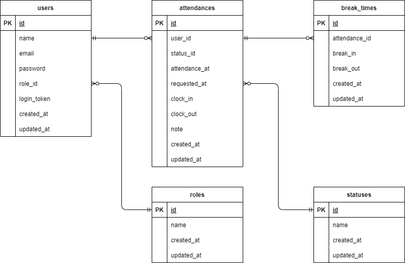

# coachtech 勤怠管理

## 概要

本システムは、一般従業員と管理者向けに設計された勤怠管理アプリケーションです。効率的な勤怠記録と管理を実現するため、以下の機能を提供します。

- **一般ユーザー:**

  - 勤怠打刻
  - 勤怠詳細の確認および修正申請
  - 申請履歴の確認

- **管理者ユーザー:**
  - 日次・月次の勤怠一覧の確認
  - 勤怠詳細の修正
  - スタッフ管理
  - 修正申請の確認および承認

---

## 使用技術（実行環境）

- **OS**: Ubuntu 24.04.1 LTS
- **環境構築**: Docker 27.3.1
- **フレームワーク**: Laravel 11.x
- **プログラミング言語**: PHP >=8.2.0, <9.0.0
- **データベース**: MySQL 8.0.26
- **Web サーバー**: Nginx 1.21.1
- **ログイン認証**: Fortify >=1.19.0, <2.0.0
- **テスト環境**: PHPUnit 10.x
- **JavaScript テスト**: Laravel Dusk >=8.3.0, <9.0.0
- **バージョン管理**: Git
- **メール検証環境**: MailHog（ログイン認証メールの確認に使用）

---

## 環境構築手順

### 1. リポジトリのクローン

```bash
git clone git@github.com:Shun-Adachi/coachtech-attendance-management.git
cd coachtech-free-market
```

### 2. Docker コンテナの起動と環境設定

```bash
make init
```

必要に応じて、プロジェクトファイルの権限を変更してください。

```bash
sudo chmod 777 -R .
```

> **注意:**　 `chmod 777` は全ユーザーに読み取り、書き込み、実行権限を付与します。セキュリティ上の理由から、本番環境では適切なパーミッション設定を行ってください。

## URL 一覧

### 開発環境

- 会員登録画面: <http://localhost/register>
- 一般ログイン画面: <http://localhost/login>
- 勤怠登録画面(一般ユーザー): <http://localhost/attendance>
- 管理者ログイン画面: <http://localhost/admin/login>
- 勤怠一覧画面(管理者): <http://localhost/admin/attendance/list>
- MailHog: <http://localhost:8025> （ログイン認証メール確認用）

---

## ダミーデータ一覧

詳細は[こちら](./dummy_data.md) を参照してください。

---

## ER 図

このプロジェクトの ER 図は以下の通りです。



---

## PHPUnit を用いたテスト実行手順

### 1. テスト用データベースの作成

```bash
docker-compose exec mysql bash
# mysqlコンテナ内で以下を実行(パスワードは"root")
mysql -u root -p

# MySQLクライアントで以下を実行
CREATE DATABASE test;
GRANT ALL PRIVILEGES ON test.* TO 'laravel_user'@'%';
FLUSH PRIVILEGES;
```

### 2. `.env.testing`ファイルの編集

`.env`ファイルをコピーし、`.env.testing`ファイルを作成して以下を設定します。

```env.testing
APP_ENV=testing
APP_KEY=
DB_DATABASE=test
```

### 3. テストを実行する

```bash
make phpunit
```

正常にテストが完了すると、以下のように表示されます。

```bash
OK (60 tests, 667 assertions)
```

## Laravel DUSK を用いた JavaScript テストの実行

### 1. テスト用データベースの作成確認

[PHPUnit のテスト実行時](#1-テスト用データベースの作成)に作成したテスト用データベース (test) が存在することを確認してください。
存在しない場合は同様の手順で作成してください。

### 2. `.env`ファイルの編集

`.env` ファイルを以下の様に変更します。

```env
APP_ENV=testing
DB_DATABASE=test
```

設定変更後、コンフィグキャッシュをクリアし、再生成して反映させます。

```bash
make cache
```

### 3. DUSK テストを実行する

以下のコマンドを実行して、テストを開始します。

```bash
make dusk
```

正常にテストが完了すると、以下のように表示されます。

```bash
Tests:    1 passed (2 assertions)
```

### 4. 開発環境への復元

DUSK テスト実行後、元の開発環境に戻すために、.env ファイルの設定を以下の様に戻します。

```env
APP_ENV=local
DB_DATABASE=laravel_db
```

変更後、再度キャッシュをクリアして設定を反映させます。

```bash
make cache
```
